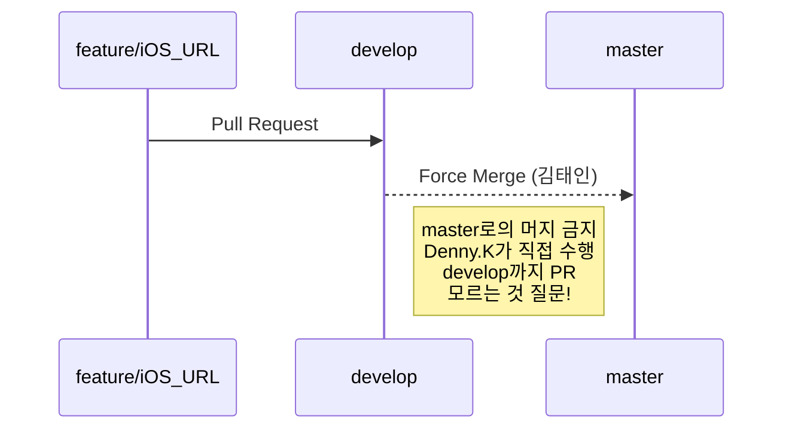

# Git Flow에 대한 설명

본 프로젝트는 다음과 같은 Git Flow를 정의하여 운영합니다.
**master - develop - feature/(이름)**
master와 develop은 반드시 Code Review 과정을 통해 이루어져야 합니다.
master로의 Merge는 Della.Kim (김태인) 이 직접 수행합니다. 이외 인원은 수행할 수 없습니다.
Manage Access, Branch Rule Configuration을 통해 접근 제한을 설정해 놓았습니다.

feature 브랜치의 경우 feature 이름을 넣어서 운영합니다.
e.g) feature/login, feature/NoticeParse 등

### feature 브랜치 명명규칙
> 1. iOS와 Android를 구분합시다. (ex. iOS_NoticeParse, Android_NoticeParse)
> 2. 확실한 Feature 명을 사용하여 알아보기 쉽게 합시다.
> 3. 미리 몇개 생성된 브랜치 이름을 참고하시면 됩니다.

### Branch 생성 방법
> master 브랜치 상태에서,
> **git checkout develop**
> 을 하여 develop으로 checkout을 한 후
> **git checkout -b feature/login 과 같이 checkout을 합니다.** 
> **(GIt 명령어 숙지 필수)**

질문 사항은 갠톡 주세요 (헷갈린다 싶으면 무조건 갠톡주세요)

# Android와 iOS 프로젝트 운영

본 프로젝트는 안드로이드와 iOS모두 오픈소스 라이브러리 배포를 할 예정이기 때문에 각각 프로젝트 폴더를 구분하여 운영합니다.

각 플랫폼 담당자는 서로의 플랫폼에 접근하지 않습니다. 접근이 필요할 경우 해당 Branch로 Checkout한 후에 작업을 해주시기 바랍니다.
**즉, iOS 작업 브랜치에서 Android 작업을 수행하는 경우가 없어야 한다는 것입니다.**
